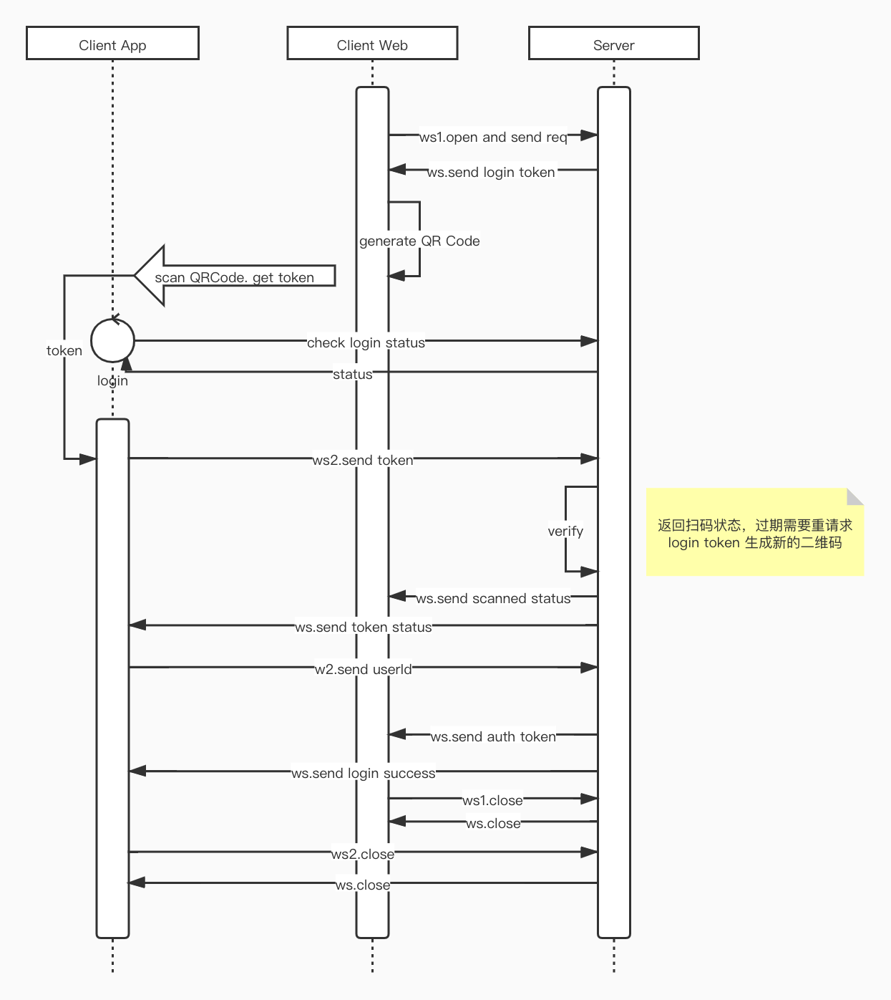
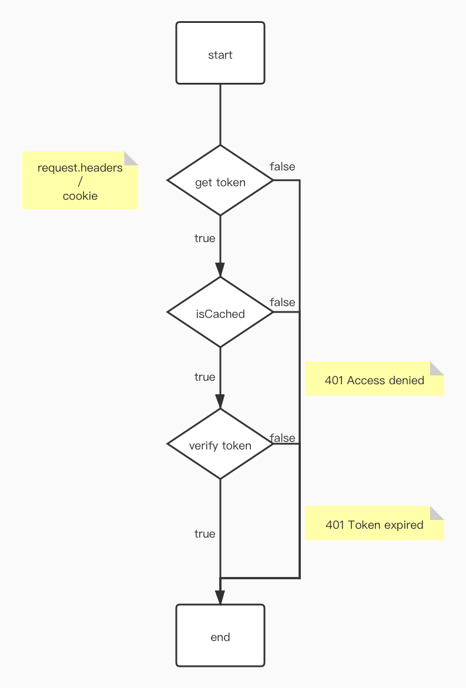

# WebSocket QRcode Login

https://user-images.githubusercontent.com/28584349/131832159-eb336b17-3747-4b25-9328-89cf7478930e.mp4

## Usage

```shell
# server
yarn dev:ser

# client
yarn dev:app
```

load http://[LOCAL_IP]:8002 in a browser to see the output.

## UML



## authorization middleware


